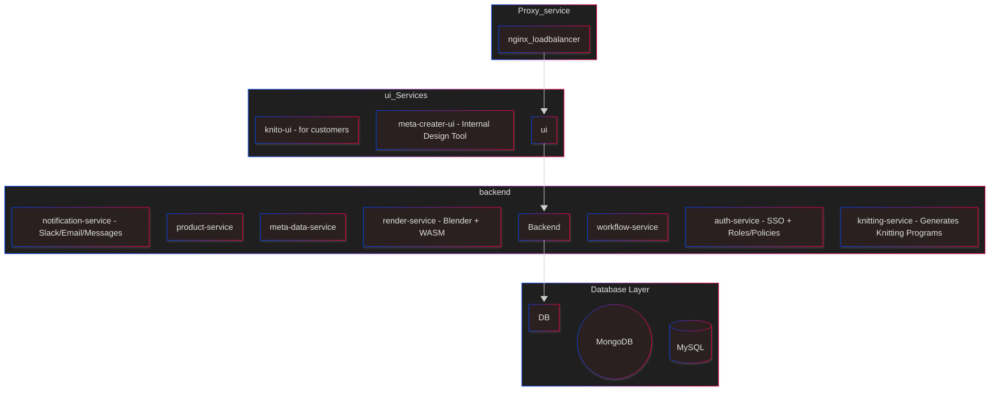
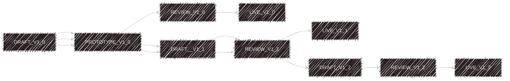
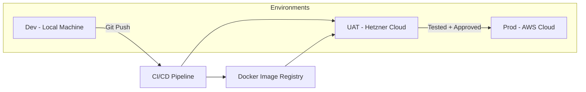

# knITO

*A meta-product creator on a modular Knitwear Platform – A creator tool for defining internal product lines.*

---

## Application Overview

`knITO` enables modular design, prototyping, review, and rendering of knitwear product metadata for internal and customer-facing processes.




---

## 🧩 Services

### 🖥️ UI Services
- **meta-creater-ui**  
  UI for creating products and categories. Designed for internal design teams to manage product metadata.

- **knito-ui**  
  A modern JavaScript-based UI for designing versatile knitwear products using the system's metadata. Built for external customers and brand partners.

---

### 🧠 Business Backend Services
- **meta-data-service**  
  A REST-based service that defines system-wide product metadata. Loads definitions into cache for high-speed access by other backend services.

- **product-service**  
  Handles actual product definitions, tightly integrated with `meta-creater-ui`. Used internally to manage product versions and variations.

- **render-service**  
  Flagship service built on Blender and WebAssembly. Responsible for generating 3D product previews and visual prototypes.

- **workflow-service**  
  Orchestrates business flows between internal and external actors. Enables user collaboration, defines responsibilities, and handles approval workflows.
  
  
> Manages the internal product lifecycle stages:
- DRAFT
- SOFT_PROTOTYPE (Image/Inventory Analysis)
- HARD_PROTOTYPE (Test Knitting)
- REVIEW (Preview, Internal Approval, Customer Demo)
- LIVE

## Versioned Workflow Examples

| Version | Workflow Path                                                                                      |
|---------|----------------------------------------------------------------------------------------------------|
| V1.0    | `DRAFT(V1.0)` → `PROTOTYPE(V1.0)` → `REVIEW(V1.0)` → `LIVE(V1.0)`                                  |
| V1.1    | `DRAFT(V1.0)` → `PROTOTYPE(V1.0)` → `DRAFT(V1.1)` → `REVIEW(V1.1)` → `LIVE(V1.1)`                  |
| V1.2    | `DRAFT(V1.0)` → `PROTOTYPE(V1.0)` → `DRAFT(V1.1)` → `REVIEW(V1.1)` → `DRAFT(V1.2)` → `REVIEW(V1.2)` → `LIVE(V1.2)` |



---

### 🛠️ Technical Backend Services
- **auth-service**  
  This service takes care of authentication, including login and single sign-on (SSO), while also defining user roles and policies to ensure secure access control.

- **notification-service**  
  This service manages notifications throughout the platform, sending updates via Email, Slack, or in-app messages. It’s often utilized by the `workflow-service` to keep business stakeholders informed.

- **knitting-service**  
  This service creates machine-readable knitting programs based on designs developed during the `prototype` and `review` phases. It produces customized instructions for knitting machines.

---

### 🛠️ Technical Backend Services
- **auth-service**  
  This service is responsible for handling authentication, including login and SSO, while also defining user roles and policies to maintain secure access control.

- **notification-service**  
  A messaging queue-based notification system that the `workflow-service` uses to alert business stakeholders through Email, Slack, or in-app messages. It’s built on a loosely coupled Pub/Sub model.

- **proxy-service**  
  This service functions as a gateway, like NGINX or AWS API Gateway, forwarding incoming requests to the `auth-service` to validate tokens and retrieve authorized roles.

---

### 🗄️ Database Layer
- **MongoDB**  
  This database is used to store digital assets, metadata documents, and configurations specific to rendering.

- **MySQL / PostgreSQL**  
  These databases are utilized for structured application data, including users, products, workflows, and audit trails.

## Sample Request/Response 


**Request**
```json
### `product-service``
{
  "product_id": "KW-001",
  "name": "Cable Knit Sweater",
  "category": "Sweater",
  "material": "Wool Blend",
  "gauge": "7 GG",
  "fit": "Regular",
  "color": "Charcoal Grey",
  "graphics"{
  "2d"[],
  "3d"[]
  }
  
}

{
  "category": "Sweater",
  "allowed_gauges": ["5 GG", "7 GG", "12 GG"],
  "materials": ["Cotton", "Wool", "Acrylic"],
  "assets": "/data/path/img1.svg"
}

{
  "colors": ["Charcoal Grey", "Navy Blue", "Olive Green", "Black", "Beige"]
}

### `orchestration-Service``

{
  "factories": [
    {
      "name": "Ludo Gmbh",
      "location": "Berlin",
      "lead_time_days": 14,
      "status": "Available"
    }
  ]
}

### `Notification-Service`

{
  "event": "metadata_created",
  "product_id": "KW-001",
  "recipients": ["factory-manager@knitwear.com"],
  "message": "New metadata for Cable Knit Sweater has been created"
}
```

Possible Users 

Designers
Knit Developers
Production Manager
Engineers


Infrastructure

Current State - need to be discussed.
100% Cloud 
dev(local-machine)-staging-UAT/Demo(aws-cloud)-prod(aws-cloud)
50% AWS Cloud Production
dev(local-machine)-staging-UAT/Demo(cloud machine on rent - hetzner)-prod(aws-cloud)
Private cloud - openstack based


Hybrid cloud setup - based on openshift 



