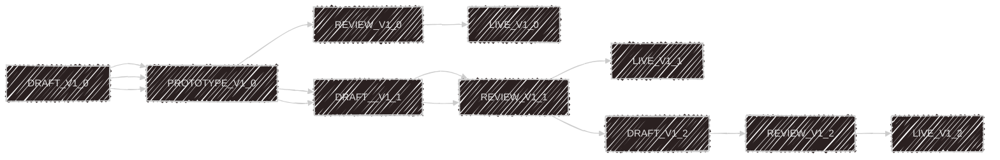

# knITO

*A meta-product creator on a modular Knitwear Platform – A creator tool for defining internal product lines.*

---

## Application Overview

`knITO` enables modular design, prototyping, review, and rendering of knitwear product metadata for internal and customer-facing processes.

---

## Services

### 🧶 Product-Service

> Core backend for handling all product-related APIs and metadata.

**Sub-services:**
- `meta-data-service` – Defines core product specifications like gauge, material, style, etc.
- `product-service` – Manages creation, updates, and retrieval of product entities.
- `category-service` – Manages product category taxonomy (e.g., Sweater, Vest, Hoodie).

**Technology Stack:** Spring Boot, Java

### 🧭 Workflow-Service

> Manages the internal product lifecycle stages:
- DRAFT
- SOFT_PROTOTYPE (Image/Inventory Analysis)
- HARD_PROTOTYPE (Test Knitting)
- REVIEW (Preview, Internal Approval, Customer Demo)
- LIVE

## Versioned Workflow Examples

| Version | Workflow Path                                                                                      |
|---------|----------------------------------------------------------------------------------------------------|
| V1.0    | `DRAFT(V1.0)` → `PROTOTYPE(V1.0)` → `REVIEW(V1.0)` → `LIVE(V1.0)`                                  |
| V1.1    | `DRAFT(V1.0)` → `PROTOTYPE(V1.0)` → `DRAFT(V1.1)` → `REVIEW(V1.1)` → `LIVE(V1.1)`                  |
| V1.2    | `DRAFT(V1.0)` → `PROTOTYPE(V1.0)` → `DRAFT(V1.1)` → `REVIEW(V1.1)` → `DRAFT(V1.2)` → `REVIEW(V1.2)` → `LIVE(V1.2)` |



### 🔐 Auth-Service

> Manages authentication and authorization across services.

### 🔄 Orchestration-Service (Optional)

> Coordinates multi-step flows between services (e.g., product creation → workflow initiation → render generation).

### 🔔 Notification-Service

> Sends internal and customer-facing notifications (email, Slack, push) on state transitions or feedback loops.

### 🖼️ Render-Service

> Uses Blender or other engines to generate 3D product previews from metadata.

### 💻 UI-Service

> Web frontend for product designers and internal stakeholders to:
- Create product metadata
- Upload images
- Preview versions
- View and manage workflow status

---

## Sample Request/Response 


**Request**
```json
### `product-service``
{
  "product_id": "KW-001",
  "name": "Cable Knit Sweater",
  "category": "Sweater",
  "material": "Wool Blend",
  "gauge": "7 GG",
  "fit": "Regular",
  "color": "Charcoal Grey",
  "graphics"{
  "2d"[],
  "3d"[]
  }
  
}

{
  "category": "Sweater",
  "allowed_gauges": ["5 GG", "7 GG", "12 GG"],
  "materials": ["Cotton", "Wool", "Acrylic"],
  "assets": "/data/path/img1.svg"
}

{
  "colors": ["Charcoal Grey", "Navy Blue", "Olive Green", "Black", "Beige"]
}

### `orchestration-Service``

{
  "factories": [
    {
      "name": "Ludo Gmbh",
      "location": "Berlin",
      "lead_time_days": 14,
      "status": "Available"
    }
  ]
}

### `Notification-Service`

{
  "event": "metadata_created",
  "product_id": "KW-001",
  "recipients": ["factory-manager@knitwear.com"],
  "message": "New metadata for Cable Knit Sweater has been created"
}
```


